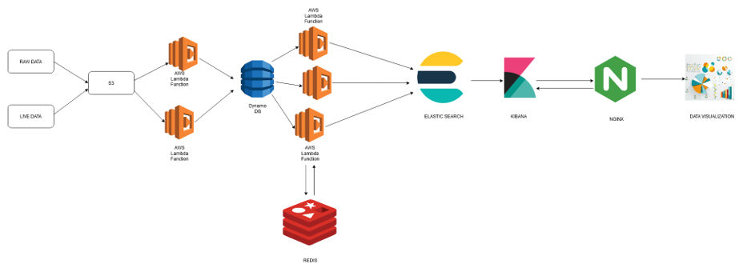

# DataMining_IPL
This project aims to show some cool intresting facts, records, results of IPL by designining and developing  dashboards which can visualize the stats, records, performance of IPL Data since its inception. we have used Distributed technologies such as Elastic search cluster, AWS lambda, Dynamo DB which help to extract, transform, and load the IPL Data.

## Team Meambers:  
 Nithin Veer Reddy 
 Sankaranarayanan 
 Mohan Dwarampudi 

### Architecture Diagram:

### Project Pipeline:

In this project we are going to build an end to end  ETL pipeline to mine the data to extract valuable  insights for better visualizations. ETL Processing will  be done via amazon web services data pipeline due to  the amount of input data.
The ETL Pipeline that we came up with is as follows: 
#### Extract: 
* Data has been sourced from multiple areas such as Scrapping from popular cricketing  and Kaggle datasets.
* All the data is then stored in Amazon S3,  which is then pushed into DynamoDB. S3  event invokes AWS Lambda which does the  data parsing before it is rested in DynamoDB. 
* The entire data has been utilized into three  tables in DynamoDB, namely - deliveries,  matches, players. This data acts as a source of  truth for all the further operations. 

#### Transform: 
* All the semi-parsed data is transformed into a  meaningful entry - JSON. 
* Triggers on DynamoDB would invoke AWS  Lambda whenever a new entry is added into  DynamoDB. 
* AWS Lambda transforms the data into  meaningful patterns, which are further loaded  into the ElasticSearch cluster. 
* AWS Lambda also fetches additional Geo  data through Google API. 
* AWS Lambda uses Redis for a quick Key:  Value mapping lookup. 

#### Load: 
* ElasticSearch indices all the incoming data  from Lambdas. 
* Data on ElasticSearch is split on the nodes in  the cluster. 
* All the 3 formats of the data are stored in  different indices - 
    *   deliveries 
    *   matches 
    *   players 

#### Elastic Search: 
* A two node cluster, served out via Load  Balancer. 
* Load Balancer endpoint would be the face of  ElasticSearch. 
* There are separate indices for all three types  of data sources which are mentioned before. 

#### KIBANA: 
* This is the face of our project. 
* Dashboards are generated separately for each  index. 
* Visualizations such as Geo-tagging,Heatmaps, Custom Metrics, Pie Charts, Bar  Graphs, Line Plots, etc. are integrated. 
* Filters applied on a visualization is applied  across the dashboard.
* Also Kibana is useful in visualizing large datasets and reduces the amount of manual effort in selecting the attributes.

